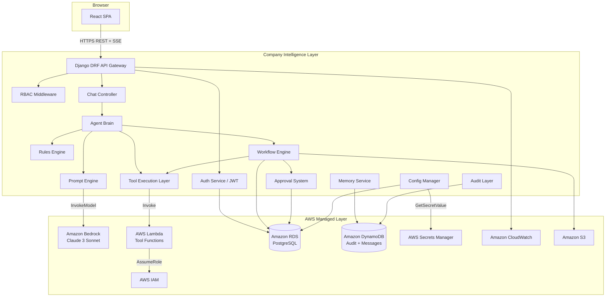
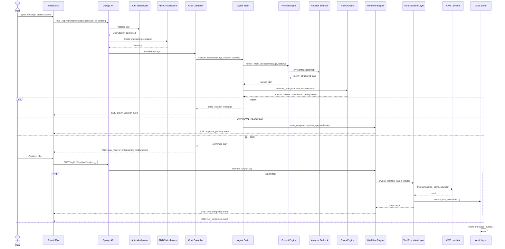
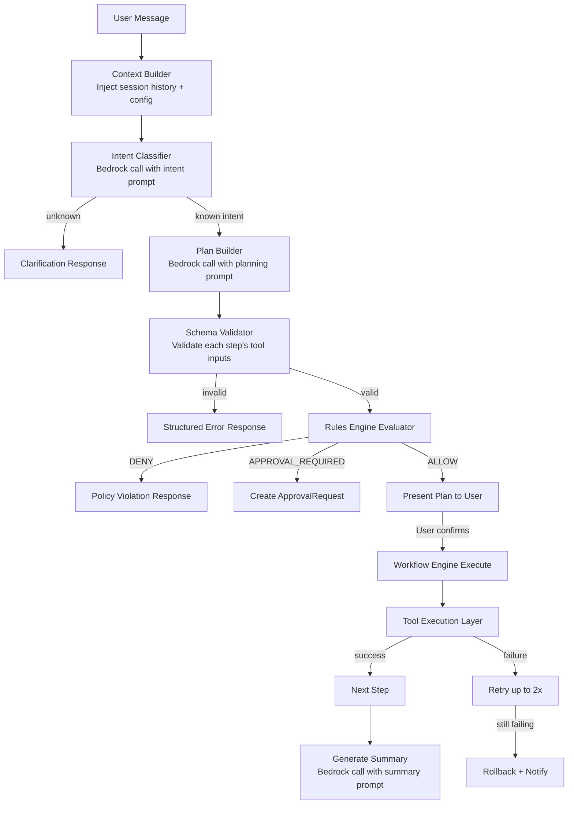
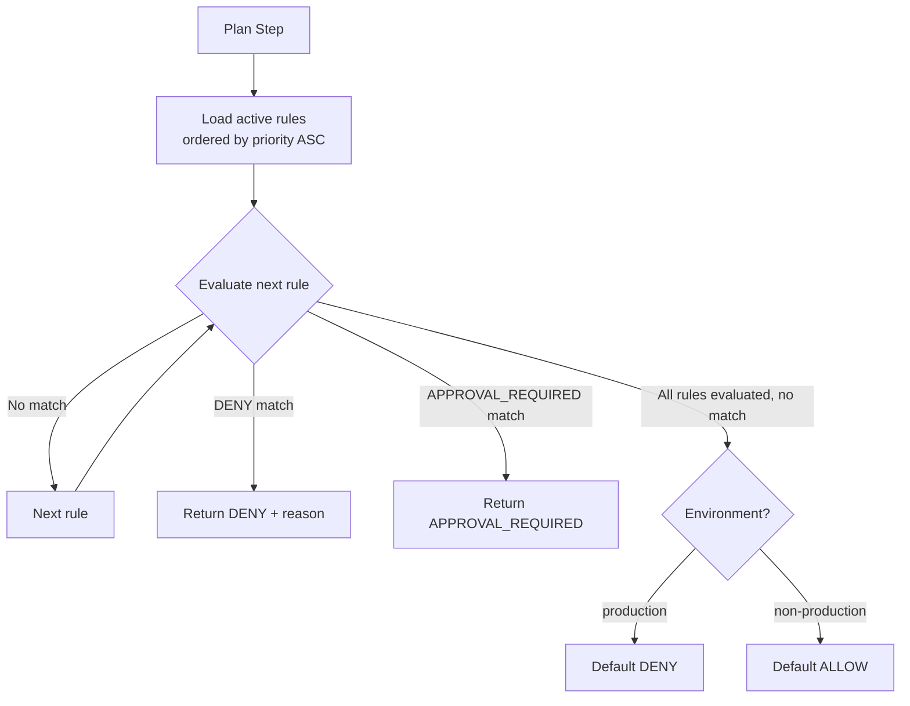
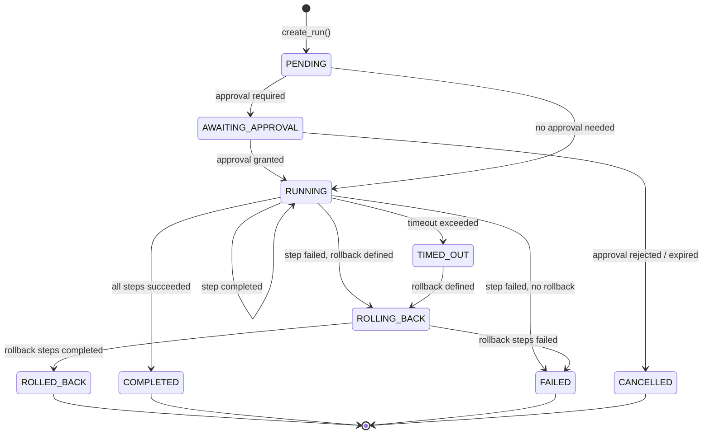
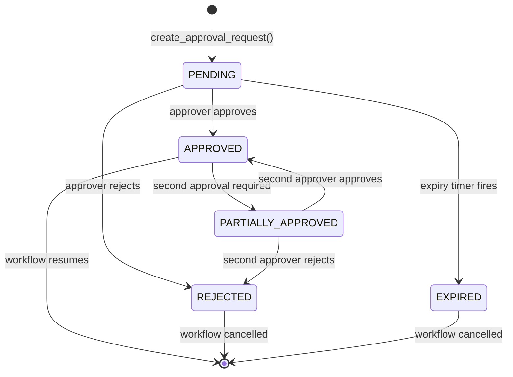
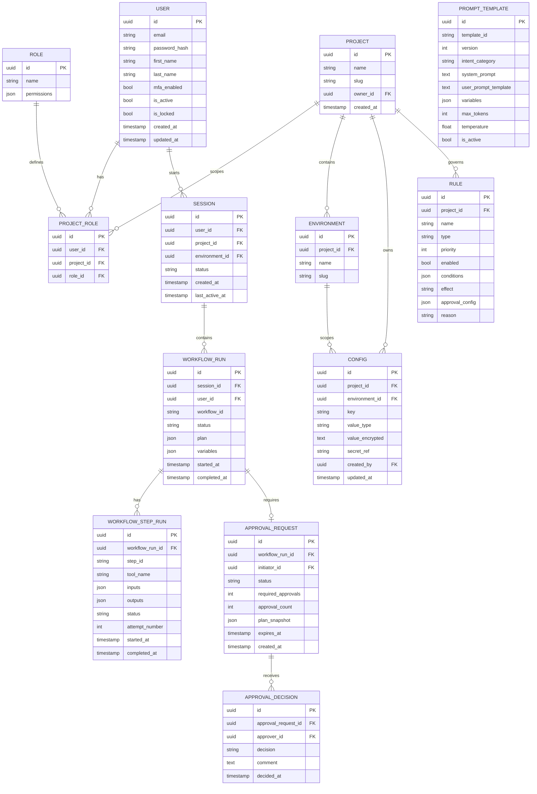
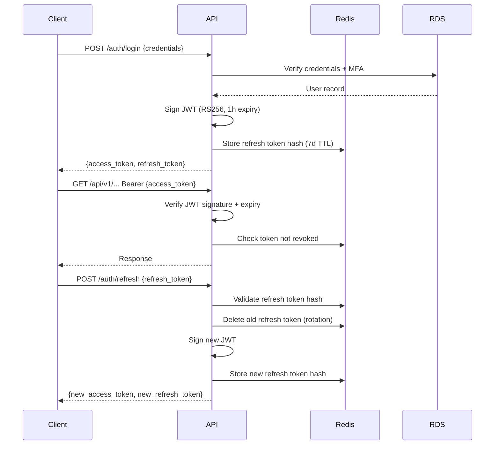

# Design Document: Hybrid AI Agent Platform

## 1. Executive Design Summary

The Hybrid AI Agent Platform is designed as a **layered hybrid architecture** where the company owns and controls the intelligence layer — including the Agent Brain, Prompt Engine, Rules Engine, Workflow Engine, Approval System, and all business logic — while delegating infrastructure concerns (compute, storage, AI inference, secrets, observability) to AWS managed services.

The architecture style is a **modular monolith backend** (Django DRF) with a **React SPA frontend**, communicating over a versioned REST API. The AI inference layer is decoupled behind the Prompt Engine, which calls Amazon Bedrock. Operational tools are isolated as AWS Lambda functions invoked through the Tool Execution Layer, providing IAM-scoped, auditable, and independently deployable action units.

This design was chosen because:
- Django DRF provides rapid API development, mature ORM, and strong ecosystem for auth/permissions
- React provides a component-driven, real-time-capable frontend with broad talent availability
- Amazon Bedrock removes model hosting burden while keeping inference costs predictable
- Lambda tool isolation ensures blast radius is limited per tool and IAM permissions are minimal
- RDS (PostgreSQL) handles relational consistency for Users, Workflows, and Approvals; DynamoDB handles high-throughput append-only writes for Audit and Messages

---

## 2. High-Level Architecture

### 2.1 Component Overview



### 2.2 Layer Responsibilities

| Layer | Owner | Responsibility |
|---|---|---|
| React SPA | Company | UI, routing, state, real-time updates |
| Django DRF API | Company | Request handling, auth, RBAC, orchestration |
| Agent Brain | Company | Intent detection, planning, tool selection, retry |
| Prompt Engine | Company | Template management, variable injection, Bedrock calls |
| Rules Engine | Company | Policy evaluation, approval triggers, environment guards |
| Workflow Engine | Company | Multi-step execution, state machine, rollback |
| Approval System | Company | Human-in-the-loop gates, routing, expiry |
| Config Manager | Company | Environment config, secret references |
| Memory Service | Company | Session context, conversation history |
| Tool Execution Layer | Company | Tool registry, schema validation, Lambda invocation |
| Audit Layer | Company | Append-only event recording |
| Amazon Bedrock | AWS | Foundation model inference (Claude 3 Sonnet) |
| AWS Lambda | AWS | Isolated tool execution compute |
| Amazon RDS | AWS | Relational data persistence |
| Amazon DynamoDB | AWS | High-throughput append-only storage |
| AWS Secrets Manager | AWS | Secret storage and rotation |
| Amazon CloudWatch | AWS | Logs, metrics, traces, alerts |
| Amazon S3 | AWS | Workflow definitions, exported reports |
| AWS IAM | AWS | Service-to-service authentication |

---

## 3. Request Lifecycle Design

### 3.1 Chat Message Lifecycle



---

## 4. Frontend Design (React SPA)

### 4.1 Page Structure and Routing

| Route | Page | Required Role |
|---|---|---|
| /login | Login | Public |
| /chat | Chat Assistant | All authenticated |
| /dashboard | Monitoring Dashboard | Admin, DevOps_Engineer |
| /config | Config Management | Admin, DevOps_Engineer |
| /approvals | Approval Center | Approver, Admin |
| /logs | Audit Logs | Auditor, Admin |
| /users | User Management | Admin |

### 4.2 State Management

- **Global state**: React Context + useReducer for auth state, user profile, active project/environment
- **Server state**: React Query (TanStack Query) for all API data fetching, caching, and invalidation
- **Real-time state**: EventSource (SSE) connection per active chat session, dispatching events into React Query cache

### 4.3 Component Architecture

```
src/
  components/
    layout/         # AppShell, Sidebar, TopNav, RoleGuard
    chat/           # MessageList, MessageBubble, InputBar, PlanConfirmModal, StatusStream
    dashboard/      # MetricsCard, WorkflowRunTable, ApprovalBadge, CostChart
    approvals/      # ApprovalCard, ApprovalDetail, ApprovalActions
    config/         # ConfigTable, ConfigEditor, SecretRefBadge
    logs/           # LogTable, LogFilters, LogExportButton
    users/          # UserTable, RoleAssignModal
    common/         # Button, Input, Badge, Modal, Spinner, ErrorBanner, EmptyState
  pages/            # One file per route, composes components
  hooks/            # useAuth, useChat, useSSE, useApprovals, useConfig
  api/              # Axios client, typed request/response functions per domain
  store/            # Auth context, project/environment context
  utils/            # formatDate, formatDuration, truncate
```

### 4.4 Real-Time Updates

- SSE endpoint: `GET /api/v1/chat/sessions/{id}/stream`
- Events: `plan_ready`, `step_started`, `step_completed`, `step_failed`, `run_completed`, `run_failed`, `approval_pending`, `approval_resolved`
- On reconnect: client sends `Last-Event-ID` header; server replays missed events from DynamoDB

### 4.5 Role-Based UI

- `RoleGuard` component wraps any UI element and renders null if the current user lacks the required role
- Navigation items are filtered server-side in the `/api/v1/auth/me` response (`allowed_pages` array)
- Destructive action buttons (delete, terminate) are hidden for Developer and Support_Team roles

---

## 5. Backend Design (Django DRF)

### 5.1 Application Module Structure

```
backend/
  config/               # Django settings (base, dev, staging, prod), urls.py, wsgi.py
  apps/
    auth_app/           # User model, JWT views, MFA, SAML/OIDC
    rbac/               # Role, Permission, ProjectRole models; permission classes
    chat/               # Session, Message models; chat views; SSE streaming
    agent/              # AgentBrain service, intent classifier, plan builder
    prompt_engine/      # PromptTemplate model, renderer, Bedrock client
    rules_engine/       # Rule model, evaluator, policy loader
    workflow_engine/    # Workflow, WorkflowRun, WorkflowStep models; executor; state machine
    approval/           # ApprovalRequest model; approval views; notifier
    config_manager/     # Config, ConfigVersion models; secret resolver
    tools/              # ToolRegistry, ToolExecution model; Lambda invoker; schema validator
    audit/              # AuditLog DynamoDB writer; query views
    memory/             # Message DynamoDB writer; context builder
    monitoring/         # Dashboard aggregation views; CloudWatch metrics publisher
  shared/
    exceptions.py       # Custom exception classes
    pagination.py       # Standard cursor pagination
    middleware.py       # RequestID, AuditContext, RateLimiter
    aws_clients.py      # Boto3 client factory with retry config
    serializers.py      # Base serializer with envelope response
```

### 5.2 Middleware Stack (request order)

1. `SecurityHeadersMiddleware` — adds HSTS, CSP, X-Frame-Options
2. `RequestIDMiddleware` — generates and attaches UUID request ID
3. `RateLimitMiddleware` — 60 req/min per user via Redis sliding window
4. `JWTAuthMiddleware` — validates Bearer token, attaches user to request
5. `AuditContextMiddleware` — captures actor, IP, request ID for audit writes
6. Django RBAC permission classes — evaluated per view

### 5.3 Background Jobs (Celery + SQS)

| Job | Trigger | Purpose |
|---|---|---|
| `expire_approval_requests` | Every 5 min | Auto-reject expired ApprovalRequests |
| `archive_audit_logs` | Daily | Move DynamoDB entries >90 days to S3 |
| `close_inactive_sessions` | Every hour | Mark sessions inactive >24h |
| `publish_cost_metrics` | Daily | Fetch Cost Explorer data, store in RDS |
| `send_approval_notifications` | On ApprovalRequest create | Email/webhook notifier |

---

## 6. AI Agent Design

### 6.1 Agent Brain Architecture



### 6.2 Intent Categories

| Intent | Description | Tools Involved |
|---|---|---|
| `deploy` | Deploy a service to an environment | Deploy_ECS_Service |
| `fetch-logs` | Retrieve and summarize logs | Fetch_CloudWatch_Logs |
| `scale` | Scale a service up or down | Scale_ECS_Service |
| `cost-analysis` | Analyze AWS costs | Get_Cost_Analysis |
| `health-check` | Check service health | Health_Check_Service |
| `describe` | Describe a resource | Describe_Resource |
| `general-query` | General question, no tool needed | None |
| `unknown` | Cannot classify | None (clarify) |

### 6.3 Prompt Engine Design

```python
# Prompt template structure
{
  "template_id": "intent_classification_v2",
  "version": 2,
  "intent_category": "intent_classification",
  "system_prompt": "...",          # Guardrail instructions + role definition
  "user_prompt_template": "...",   # Jinja2 template with {{ variables }}
  "variables": ["message", "history", "available_tools", "active_environment"],
  "max_tokens": 1024,
  "temperature": 0.1,
  "model_id": "anthropic.claude-3-sonnet-20240229-v1:0"
}
```

- Templates stored in RDS, cached in Redis with 5-minute TTL
- Variable injection uses Jinja2 with strict undefined mode (raises on missing vars)
- Token budget: 6,000 tokens for context + 2,000 for completion = 8,000 total
- Every prompt includes a `GUARDRAILS` section as the first system instruction block

### 6.4 Guardrails

| Guardrail | Mechanism | Action on Violation |
|---|---|---|
| Tool allowlist | Check tool name against registry | Discard output, log violation |
| Input schema | JSON Schema validation | Return validation error |
| Max tool calls | Counter per message (limit: 10) | Halt execution, notify user |
| Destructive action gate | Keyword + action type check | Require ApprovalRequest |
| Secret/PII output | Regex + classifier on model output | Redact + log violation |
| Off-topic detection | Classifier in system prompt | Safe fallback response |

---

## 7. Rules Engine Design

### 7.1 Rule Schema

```json
{
  "rule_id": "prod-deploy-approval",
  "name": "Production Deployment Requires Approval",
  "type": "approval-trigger",
  "priority": 10,
  "enabled": true,
  "conditions": {
    "environment": ["production"],
    "action": ["deploy", "scale"],
    "resource_type": ["ecs-service"]
  },
  "effect": "APPROVAL_REQUIRED",
  "approval_config": {
    "required_approvers": 1,
    "approver_roles": ["Admin", "DevOps_Engineer"],
    "expiry_hours": 24
  },
  "reason": "All production deployments require DevOps approval"
}
```

### 7.2 Rule Types

| Type | Description |
|---|---|
| `environment-restriction` | Block actions in specified environments |
| `time-window` | Allow actions only within defined time windows |
| `action-allowlist` | Restrict which actions a role can perform |
| `approval-trigger` | Require human approval before execution |
| `resource-limit` | Cap the number of resources affected per action |

### 7.3 Policy Evaluation Flow



---

## 8. Workflow Engine Design

### 8.1 Workflow Definition Format

```json
{
  "workflow_id": "deploy-to-staging",
  "name": "Deploy Service to Staging",
  "version": 1,
  "timeout_minutes": 30,
  "steps": [
    {
      "step_id": "health-check",
      "type": "tool",
      "tool": "Health_Check_Service",
      "inputs": { "service": "{{ service_name }}", "environment": "staging" },
      "on_failure": "abort",
      "retry": { "max_attempts": 2, "backoff_seconds": 5 }
    },
    {
      "step_id": "deploy",
      "type": "tool",
      "tool": "Deploy_ECS_Service",
      "inputs": { "service": "{{ service_name }}", "image": "{{ image_tag }}", "environment": "staging" },
      "depends_on": ["health-check"],
      "on_failure": "rollback",
      "rollback_step": "rollback-deploy"
    },
    {
      "step_id": "rollback-deploy",
      "type": "tool",
      "tool": "Deploy_ECS_Service",
      "inputs": { "service": "{{ service_name }}", "image": "{{ previous_image_tag }}", "environment": "staging" },
      "condition": "never"
    }
  ]
}
```

### 8.2 WorkflowRun State Machine



---

## 9. Approval System Design

### 9.1 Approval Request Lifecycle



### 9.2 Approval Rules

- The initiating User's ID is stored on the ApprovalRequest and compared against the approver's ID on every approval action
- If `initiator_id == approver_id`, the action is rejected with HTTP 403 and a `self_approval_not_allowed` error code
- Multi-approval: `required_approvals` field on ApprovalRequest; `approval_count` incremented on each approval; workflow resumes when `approval_count >= required_approvals`
- Expiry: Celery task `expire_approval_requests` runs every 5 minutes, queries for `status=PENDING AND expires_at < now()`, transitions to EXPIRED, cancels WorkflowRun

### 9.3 Notification Design

- On ApprovalRequest creation: Celery task dispatched to `send_approval_notifications`
- Notification channels: Platform UI (SSE push to eligible approvers), email (SES), optional webhook
- Notification payload includes: request ID, workflow name, initiator, plan summary, approve/reject deep links

---

## 10. Tool Execution Layer Design

### 10.1 Tool Registry Schema

```python
TOOL_REGISTRY = {
  "Deploy_ECS_Service": {
    "function_name": "haap-tool-deploy-ecs",
    "iam_role_arn": "arn:aws:iam::ACCOUNT:role/haap-tool-deploy-ecs-role",
    "timeout_seconds": 300,
    "input_schema": {
      "type": "object",
      "required": ["service_name", "image_tag", "environment"],
      "properties": {
        "service_name": {"type": "string"},
        "image_tag": {"type": "string"},
        "environment": {"type": "string", "enum": ["dev", "staging", "production"]}
      }
    },
    "output_schema": {
      "type": "object",
      "properties": {
        "deployment_id": {"type": "string"},
        "status": {"type": "string"},
        "service_arn": {"type": "string"}
      }
    }
  }
}
```

### 10.2 Built-in Tools

| Tool | Lambda Function | IAM Actions |
|---|---|---|
| Deploy_ECS_Service | haap-tool-deploy-ecs | ecs:UpdateService, ecs:DescribeServices |
| Fetch_CloudWatch_Logs | haap-tool-fetch-logs | logs:FilterLogEvents, logs:DescribeLogGroups |
| Scale_ECS_Service | haap-tool-scale-ecs | ecs:UpdateService, application-autoscaling:* |
| Get_Cost_Analysis | haap-tool-cost-analysis | ce:GetCostAndUsage, ce:GetCostForecast |
| Health_Check_Service | haap-tool-health-check | ecs:DescribeServices, elasticloadbalancing:DescribeTargetHealth |
| Describe_Resource | haap-tool-describe | ecs:Describe*, ec2:Describe*, rds:Describe* |

### 10.3 Invocation Pattern

```python
def invoke_tool(tool_name: str, inputs: dict, run_id: str) -> ToolResult:
    tool = TOOL_REGISTRY[tool_name]          # KeyError → ToolNotFoundError
    validate_inputs(inputs, tool.input_schema)  # ValidationError → return error
    role_creds = assume_role(tool.iam_role_arn)
    lambda_client = boto3.client("lambda", **role_creds)
    try:
        response = lambda_client.invoke(
            FunctionName=tool.function_name,
            Payload=json.dumps({"run_id": run_id, "inputs": inputs}),
        )
        result = parse_lambda_response(response)
    except ReadTimeoutError:
        result = ToolResult(status="timeout", ...)
    audit_layer.record_tool_execution(tool_name, inputs, result, run_id)
    return result
```

---

## 11. Data Design

### 11.1 Entity Relationship Diagram



### 11.2 DynamoDB Tables

**AuditLog Table**
- Partition key: `pk = "AUDIT#YYYY-MM"` (monthly partition)
- Sort key: `sk = "EVENT#{timestamp}#{event_id}"`
- GSI: `actor_id-timestamp-index` (for per-user queries)
- GSI: `event_type-timestamp-index` (for event type queries)
- TTL: `expires_at` (set to 90 days; archival job copies to S3 before expiry)

**Message Table**
- Partition key: `pk = "SESSION#{session_id}"`
- Sort key: `sk = "MSG#{timestamp}#{message_id}"`
- TTL: `expires_at` (set to 30 days for inactive sessions)

**ToolExecution Table**
- Partition key: `pk = "RUN#{workflow_run_id}"`
- Sort key: `sk = "TOOL#{timestamp}#{execution_id}"`

---

## 12. API Design

### 12.1 Authentication

| Method | Path | Description |
|---|---|---|
| POST | /api/v1/auth/login | Authenticate, receive JWT + refresh token |
| POST | /api/v1/auth/refresh | Exchange refresh token for new access token |
| POST | /api/v1/auth/logout | Invalidate tokens |
| GET | /api/v1/auth/me | Get current user profile + permissions |

**Login Request:**
```json
{ "email": "user@example.com", "password": "...", "mfa_code": "123456" }
```
**Login Response:**
```json
{
  "data": {
    "access_token": "eyJ...",
    "refresh_token": "eyJ...",
    "expires_in": 3600,
    "user": { "id": "uuid", "email": "user@example.com", "roles": ["DevOps_Engineer"] }
  },
  "error": null,
  "meta": { "request_id": "req-uuid" }
}
```

### 12.2 Chat

| Method | Path | Description |
|---|---|---|
| POST | /api/v1/chat/sessions | Create new chat session |
| GET | /api/v1/chat/sessions | List user's sessions (paginated) |
| POST | /api/v1/chat/sessions/{id}/messages | Send message |
| GET | /api/v1/chat/sessions/{id}/stream | SSE stream for session events |
| POST | /api/v1/chat/sessions/{id}/confirm | Confirm execution plan |
| DELETE | /api/v1/chat/sessions/{id} | Delete session and history |

### 12.3 Approvals

| Method | Path | Description |
|---|---|---|
| GET | /api/v1/approvals | List pending approvals for current user |
| GET | /api/v1/approvals/{id} | Get approval request detail |
| POST | /api/v1/approvals/{id}/approve | Approve request |
| POST | /api/v1/approvals/{id}/reject | Reject request |

### 12.4 Config

| Method | Path | Description |
|---|---|---|
| GET | /api/v1/projects/{pid}/configs | List configs for project+environment |
| POST | /api/v1/projects/{pid}/configs | Create config value |
| PUT | /api/v1/projects/{pid}/configs/{key} | Update config value |
| DELETE | /api/v1/projects/{pid}/configs/{key} | Delete config value |
| GET | /api/v1/projects/{pid}/configs/{key}/history | Get version history |

### 12.5 Audit Logs

| Method | Path | Description |
|---|---|---|
| GET | /api/v1/audit/logs | Query audit logs (filters: date_from, date_to, event_type, actor_id) |
| GET | /api/v1/audit/logs/export | Export logs as JSON or CSV |

### 12.6 Users

| Method | Path | Description |
|---|---|---|
| GET | /api/v1/users | List users (Admin only) |
| POST | /api/v1/users | Create user (Admin only) |
| GET | /api/v1/users/{id} | Get user detail |
| PUT | /api/v1/users/{id}/roles | Assign roles (Admin only) |
| DELETE | /api/v1/users/{id} | Deactivate user (Admin only) |

### 12.7 Standard Error Response

```json
{
  "data": null,
  "error": {
    "code": "validation_error",
    "message": "Request validation failed",
    "details": [
      { "field": "environment", "reason": "Must be one of: dev, staging, production" }
    ]
  },
  "meta": { "request_id": "req-uuid" }
}
```

---

## 13. Security Design

### 13.1 JWT Flow



### 13.2 Security Controls Summary

| Control | Implementation |
|---|---|
| Transport encryption | TLS 1.2+ enforced at ALB |
| Data at rest | RDS encryption (AES-256), DynamoDB encryption, S3 SSE-S3 |
| JWT signing | RS256 with 2048-bit key pair; private key in Secrets Manager |
| Secret storage | All secrets in AWS Secrets Manager; never in env vars or DB |
| IAM | Per-tool IAM roles; backend uses instance profile; no long-lived keys |
| Input sanitization | Django serializer validation + bleach for any HTML content |
| Rate limiting | Redis sliding window, 60 req/min per user |
| RBAC | DRF permission classes on every view; project-scoped roles |
| Audit integrity | DynamoDB append-only; no delete API exposed |
| Password policy | Django password validators: min 12 chars, complexity enforced |
| Account lockout | 5 failed attempts → locked; Admin notified via CloudWatch alarm |

---

## 14. Observability Design

### 14.1 Logging Strategy

- **Application logs**: Structured JSON via Python `structlog`; fields: `request_id`, `user_id`, `level`, `message`, `duration_ms`, `service`
- **Audit logs**: Written to DynamoDB by Audit Layer; also streamed to CloudWatch Logs via Lambda trigger for real-time alerting
- **Lambda tool logs**: Each Lambda writes structured logs to its own CloudWatch Log Group `/aws/lambda/haap-tool-{name}`

### 14.2 Metrics

| Metric | Source | Alert Threshold |
|---|---|---|
| `chat.intent_classification_latency_ms` | Agent Brain | P95 > 3000ms |
| `workflow.run_duration_ms` | Workflow Engine | P95 > 300000ms |
| `tool.invocation_error_rate` | Tool Execution Layer | > 5% over 5 min |
| `approval.pending_count` | Approval System | > 10 pending |
| `auth.failed_login_count` | Auth Service | > 5 per user per 10 min |
| `api.error_rate_5xx` | Django middleware | > 1% over 5 min |
| `guardrail.violation_count` | Agent Brain | Any violation |

### 14.3 Distributed Tracing

- AWS X-Ray enabled on Django backend and all Lambda functions
- Trace ID propagated via `X-Amzn-Trace-Id` header
- Trace spans: API request → Agent Brain → Bedrock call → Rules evaluation → Tool invocation → Lambda execution

---

## 15. Scalability and Performance Design

### 15.1 Targets

| Metric | Target |
|---|---|
| Concurrent sessions | 100+ |
| Chat intent classification | < 3s P95 |
| Workflow step execution | < 5 min P95 |
| API response (non-AI) | < 200ms P95 |
| Dashboard load | < 1s P95 |

### 15.2 Scaling Strategy

- **Backend**: ECS Fargate with auto-scaling on CPU > 70%; min 2 tasks, max 20 tasks
- **Celery workers**: Separate ECS service, scales on SQS queue depth
- **RDS**: Multi-AZ PostgreSQL; read replica for dashboard queries
- **DynamoDB**: On-demand capacity mode; auto-scales with traffic
- **Lambda**: Provisioned concurrency for frequently-used tools (Deploy, Health Check)
- **Redis (ElastiCache)**: Cluster mode, 2 shards; used for rate limiting, token revocation, prompt template cache

### 15.3 Caching Strategy

| Data | Cache | TTL |
|---|---|---|
| Prompt templates | Redis | 5 min |
| User permissions | Redis | 1 min (invalidated on role change) |
| Config values | Redis | 30 sec |
| Dashboard aggregates | Redis | 30 sec |
| Tool registry | In-process (Django startup) | Until restart |

---

## 16. Deployment Design

### 16.1 Environment Architecture

```
dev       → Single ECS task, RDS t3.micro, DynamoDB on-demand, no HA
staging   → 2 ECS tasks, RDS t3.small Multi-AZ, DynamoDB on-demand
production → 2-20 ECS tasks (auto-scale), RDS r6g.large Multi-AZ + read replica, DynamoDB on-demand
```

### 16.2 CI/CD Pipeline

```mermaid
flowchart LR
    PR[Pull Request] --> LINT[Lint + Type Check]
    LINT --> TEST[Unit + Property Tests]
    TEST --> BUILD[Docker Build]
    BUILD --> PUSH[Push to ECR]
    PUSH --> DEPLOY_DEV[Deploy to Dev\nauto on merge to main]
    DEPLOY_DEV --> SMOKE[Smoke Tests]
    SMOKE --> DEPLOY_STAGING[Deploy to Staging\nauto on passing smoke]
    DEPLOY_STAGING --> INT[Integration Tests]
    INT --> MANUAL[Manual Approval Gate]
    MANUAL --> DEPLOY_PROD[Deploy to Production\nBlue/Green via ECS]
    DEPLOY_PROD --> VERIFY[Health Check Verification]
    VERIFY -->|fail| ROLLBACK[Auto Rollback]
    VERIFY -->|pass| DONE[Done]
```



### 16.3 Secrets Injection

- All secrets fetched from AWS Secrets Manager at container startup via `aws-secrets-manager-env` sidecar
- No secrets in environment variables, Dockerfiles, or source code
- Secret rotation: RDS credentials rotated every 30 days via Secrets Manager rotation Lambda

---

## 17. Failure Scenarios and Recovery

| Scenario | Detection | Recovery |
|---|---|---|
| Bedrock API unavailable | HTTP 5xx from Bedrock | Retry 3x with exponential backoff; return user-facing error after exhaustion |
| Lambda tool timeout | ReadTimeoutError after tool timeout | Mark step as failed; trigger rollback if defined; record in AuditLog |
| RDS outage | Django DB connection error | Return 503; Celery jobs pause; reconnect on recovery |
| DynamoDB throttling | ProvisionedThroughputExceededException | Exponential backoff with jitter; CloudWatch alarm |
| Invalid agent plan | Schema validation failure | Discard plan; log guardrail violation; ask user to rephrase |
| Approval timeout | Celery expiry job | Auto-reject; cancel WorkflowRun; notify initiator |
| Partial workflow failure | Step status = FAILED | Execute rollback steps in reverse; emit `run_rolled_back` event |
| ECS task crash | ECS health check failure | ECS replaces task automatically; in-flight requests fail with 502 |

---

## 18. Tradeoffs and Decisions

| Decision | Choice | Rationale |
|---|---|---|
| AI inference | Amazon Bedrock | No model hosting ops; pay-per-token; Claude 3 Sonnet balances quality and cost |
| Backend framework | Django DRF | Mature ORM, built-in admin, strong auth ecosystem, fast API development |
| Relational DB | PostgreSQL on RDS | ACID compliance for Workflows/Approvals; familiar query model; managed backups |
| Append-only store | DynamoDB | High write throughput for Audit/Messages; no schema migration risk; TTL built-in |
| Tool isolation | Lambda | Per-tool IAM roles; independent deployment; auto-scaling; no persistent compute cost |
| Hybrid model | Company intelligence + AWS infra | Company retains control of business logic, prompts, rules; AWS handles undifferentiated heavy lifting |
| Frontend | React + React Query | Component ecosystem; React Query handles server state elegantly; SSE support |
| Real-time | SSE over WebSocket | Simpler than WebSocket for unidirectional server push; works through ALB without sticky sessions |

---

## 19. Correctness Properties

*A property is a characteristic or behavior that should hold true across all valid executions of a system — essentially, a formal statement about what the system should do. Properties serve as the bridge between human-readable specifications and machine-verifiable correctness guarantees.*


### 19.1 Correctness Properties

Property 1: Authentication round-trip validity
*For any* valid user credentials, submitting them to the login endpoint should produce an access token that, when verified, is associated with that user's identity and has not expired.
**Validates: Requirements 1.1**

Property 2: Invalid credentials are always rejected
*For any* credential pair where the password does not match the stored hash for the given email, the login endpoint should return a non-2xx status code and never issue a token.
**Validates: Requirements 1.2**

Property 3: RBAC permission enforcement
*For any* user-role-action triple where the action is not in the role's permission set, the API endpoint for that action should return HTTP 403 and the action should not be executed.
**Validates: Requirements 2.2, 2.3**

Property 4: Self-approval prevention invariant
*For any* ApprovalRequest, if the user attempting to approve has the same ID as the user who initiated the associated WorkflowRun, the approval action should be rejected with a self_approval_not_allowed error.
**Validates: Requirements 2.7, 8.4**

Property 5: Session context window invariant
*For any* Session with more than 50 messages, the context provided to the Agent Brain for the next message should contain exactly the last 50 messages in chronological order, never more.
**Validates: Requirements 3.8**

Property 6: Intent classification output domain invariant
*For any* user message, the intent classification result should be one of the defined intent categories: deploy, fetch-logs, scale, cost-analysis, health-check, describe, general-query, unknown — never an arbitrary string.
**Validates: Requirements 4.1**

Property 7: Execution plan structural invariant
*For any* message classified with a non-unknown intent, the generated execution plan should contain at least one step, and each step should have a non-empty tool name that exists in the tool registry and a non-null inputs object.
**Validates: Requirements 4.3, 14.1**

Property 8: Tool retry counting invariant
*For any* tool that consistently returns a failure response, the Tool Execution Layer should invoke it exactly 3 times total (1 initial + 2 retries) before marking the step as failed — never fewer, never more.
**Validates: Requirements 4.7, 7.4**

Property 9: Destructive action safety invariant
*For any* WorkflowRun that includes a destructive action step, the run should never reach COMPLETED status unless there exists a corresponding ApprovalRequest with status APPROVED and the approver is not the initiator.
**Validates: Requirements 4.8**

Property 10: Prompt token budget invariant
*For any* prompt rendering invocation, the total token count of the rendered prompt (system + user) should never exceed 8,000 tokens.
**Validates: Requirements 5.3**

Property 11: Rules evaluated before tool execution ordering invariant
*For any* WorkflowRun, for every tool execution event in the audit log, there should exist a corresponding rules evaluation event with an earlier timestamp for the same plan step.
**Validates: Requirements 6.1**

Property 12: Rules short-circuit on first DENY
*For any* rule set containing a DENY rule at priority N, when a plan step matches that rule, no rules with priority greater than N should be evaluated for that step.
**Validates: Requirements 6.7**

Property 13: Rollback step ordering invariant
*For any* workflow with steps [S1, S2, S3] where S3 fails and rollback is triggered, the rollback steps should execute in the order [rollback-S3, rollback-S2, rollback-S1] — the reverse of the original execution order.
**Validates: Requirements 7.5**

Property 14: WorkflowRun persistence round-trip
*For any* WorkflowRun created with a given plan and status, querying that run by ID should return the same plan and status without data loss or corruption.
**Validates: Requirements 7.9**

Property 15: ApprovalRequest expiry state transition
*For any* ApprovalRequest where expires_at is in the past and status is PENDING, after the expiry job runs, the status should be EXPIRED and the associated WorkflowRun should be CANCELLED.
**Validates: Requirements 8.5**

Property 16: Secret reference storage invariant
*For any* configuration value of type secret-reference, the value stored in the database should be a reference string (e.g., "secret:arn:...") and never the actual secret value retrieved from Secrets Manager.
**Validates: Requirements 9.4**

Property 17: Config version history growth invariant
*For any* configuration key, after N updates, the version history for that key should contain exactly N+1 entries (initial creation + N updates), each with a distinct timestamp and the correct previous value.
**Validates: Requirements 9.5**

Property 18: Tool input validation pre-condition invariant
*For any* tool invocation where the inputs do not conform to the tool's JSON schema, the Lambda function should never be invoked — the error should be returned before any AWS API call is made.
**Validates: Requirements 10.2**

Property 19: Tool result structural completeness invariant
*For any* tool invocation (whether it succeeds, fails, or times out), the returned ToolResult object should contain all required fields: status, output, error_message, execution_duration_ms, and tool_name — none should be null or missing.
**Validates: Requirements 10.7**

Property 20: Audit log immutability invariant
*For any* AuditLog entry that has been written, any attempt to modify or delete that entry via the Platform API should return an error, and the entry should remain unchanged in storage.
**Validates: Requirements 11.3**

Property 21: Tool invocation count limit invariant
*For any* single user message, the total number of tool invocations triggered by the Agent Brain's response to that message should never exceed 10, regardless of the complexity of the generated plan.
**Validates: Requirements 14.6**

---

## 20. Error Handling

### 20.1 Error Hierarchy

```
PlatformError (base)
├── AuthenticationError (401)
├── AuthorizationError (403)
├── ValidationError (400)
├── NotFoundError (404)
├── RateLimitError (429)
├── ConflictError (409)
├── ServiceUnavailableError (503)
├── AgentError
│   ├── IntentClassificationError
│   ├── PlanValidationError
│   ├── GuardrailViolationError
│   └── MaxToolCallsExceededError
├── WorkflowError
│   ├── WorkflowTimeoutError
│   ├── StepExecutionError
│   └── RollbackError
├── ToolError
│   ├── ToolNotFoundError
│   ├── ToolInputValidationError
│   ├── ToolTimeoutError
│   └── ToolExecutionError
└── ExternalServiceError
    ├── BedrockError
    ├── LambdaError
    └── SecretsManagerError
```

### 20.2 Error Response Contract

All errors return the standard envelope with `data: null` and a populated `error` object. HTTP status codes follow REST conventions. Internal errors (5xx) include a `request_id` for log correlation but never expose stack traces to clients.

---

## 21. Testing Strategy

### 21.1 Dual Testing Approach

The Platform uses both unit tests and property-based tests as complementary strategies:

- **Unit tests**: Verify specific examples, edge cases, integration points, and error conditions
- **Property-based tests**: Verify universal properties across randomly generated inputs (minimum 100 iterations per property)

### 21.2 Property-Based Testing

- **Library**: `hypothesis` (Python) for backend; `fast-check` for any frontend logic
- **Minimum iterations**: 100 per property test
- **Tag format**: `# Feature: hybrid-ai-agent-platform, Property {N}: {property_title}`
- Each correctness property in Section 19 maps to exactly one property-based test

### 21.3 Test Coverage Targets

| Layer | Unit Tests | Property Tests |
|---|---|---|
| Auth Service | Login flows, token refresh, lockout | Properties 1, 2 |
| RBAC | Permission checks per role | Properties 3, 4 |
| Agent Brain | Intent classification, plan building | Properties 6, 7, 8, 9, 21 |
| Prompt Engine | Template rendering, token counting | Property 10 |
| Rules Engine | Rule evaluation, priority ordering | Properties 11, 12 |
| Workflow Engine | Step execution, rollback, persistence | Properties 13, 14 |
| Approval System | Approval flow, expiry, self-approval | Properties 4, 15 |
| Config Manager | CRUD, secret refs, versioning | Properties 16, 17 |
| Tool Execution Layer | Invocation, validation, results | Properties 18, 19 |
| Audit Layer | Write, query, immutability | Property 20 |
| Memory Service | Context window, session lifecycle | Property 5 |

### 21.4 Integration Tests

- End-to-end workflow scenarios from Section 20 of requirements (deploy, logs, production deploy with approval, cost analysis, incident troubleshooting)
- Run against a local Docker Compose stack with mocked Bedrock and Lambda

---

## 22. Implementation Roadmap

### Phase 1 — MVP (Weeks 1–8)
- Auth Service (JWT, RBAC, 6 roles)
- Agent Brain (intent classification, single-step execution)
- Prompt Engine (basic templates, Bedrock integration)
- Rules Engine (allow/deny, environment restriction)
- Tool Execution Layer (Deploy_ECS_Service, Fetch_CloudWatch_Logs, Health_Check_Service)
- Audit Layer (DynamoDB writes)
- Memory Service (session context, 50-message window)
- React UI: Login, Chat, basic Dashboard

### Phase 2 — Core Platform (Weeks 9–16)
- Workflow Engine (sequential, retry, rollback, state machine)
- Approval System (routing, expiry, notifications)
- Config Manager (CRUD, secret references, versioning)
- Prompt Engine versioning and rollback
- Additional tools: Scale_ECS_Service, Describe_Resource
- React UI: Approval Center, Config Management, Audit Logs

### Phase 3 — Advanced Features (Weeks 17–24)
- Parallel and conditional workflow execution
- Get_Cost_Analysis tool
- A/B prompt template testing
- Advanced Monitoring Dashboard with cost metrics
- SAML 2.0 / OIDC SSO integration
- Compliance reporting and data export
- OpenAPI 3.0 documentation portal
- Performance hardening: caching, read replicas, Lambda provisioned concurrency

---

## 23. Open Questions

1. **Model selection**: Is Claude 3 Sonnet the approved model, or should the Prompt Engine support model switching per intent category?
2. **Multi-tenancy**: Is the Platform single-tenant (one company) or multi-tenant (multiple organizations)? This affects data isolation design significantly.
3. **Email provider**: Which email service should be used for approval notifications — SES, SendGrid, or an existing enterprise relay?
4. **SSO priority**: Is SAML/OIDC SSO required for MVP or Phase 2?
5. **Compliance framework**: Which specific compliance frameworks (SOC 2, ISO 27001, HIPAA) must the audit trail support?
6. **Tool extensibility**: Should third-party teams be able to register custom tools via a self-service API, or is the tool registry Admin-only?
7. **Bedrock region**: Which AWS region should Bedrock calls be routed to, given model availability constraints?
8. **Approval SLA**: Is the 24-hour default approval expiry window acceptable, or do different workflow types need different expiry windows?
